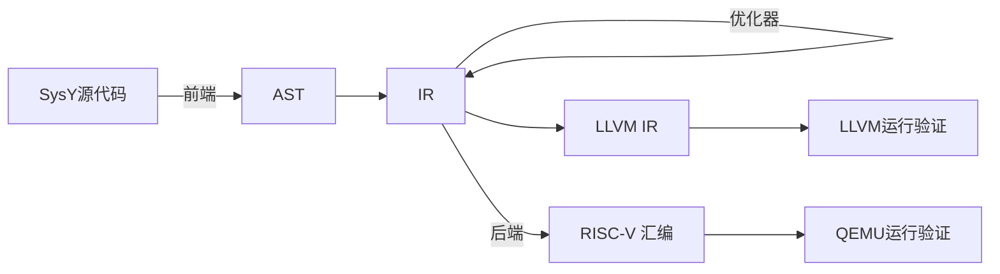

# Staisp

Sysy Translation And Interpretation System Pro

本项目荣获 2024 全国大学生计算机系统能力大赛 编译系统设计赛 实现赛 RISC-V 赛道全国二等奖

## 架构

### 前端

lex+yacc 得到 AST，之后再生成 IR

### 中端

中端为 SSA 的类 LLVM IR 架构，可以输出 LLVM IR 用于验证

实现了下列优化：

- 指令化简与合并
- 下标转指针
- 循环展开
- 函数内联
- 分支化简
- 基本块合并
- 常量传播
- 死代码消除
- 全局转局部
- 内存转寄存器
- 循环不变量外提
- 全局值标号
- 全局代码移动

### 后端

后端采用线性扫描的寄存器分配算法

实现了下列优化：

- 窥孔优化
- 尾递归优化
- 递归记忆化

### 验证

- 采用 gtest 框架进行测试
- 中端用 LLVM 提供的 llc 编译验证
- 后端用 qemu 模拟 RISC-V 环境